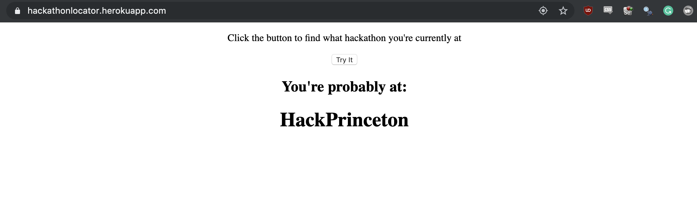

# HackathonLocator
Web app that uses location services to determine which MLH sponsored hackathon you're probably at right now

<h1 align="center"><a href="https://hackathonlocator.herokuapp.com">View The Demo</a></h1>

<p align="center">

</p>

# API

## GET: /getByLongLat?lat={latitude}&long={longitude}

### ?expand=True

```javascript
Response:
[
  {
    "distance": 913.4828683815352, 
    "title": "QBHacks 2019"
  }, 
  {
    "distance": 3692.142205746163, 
    "title": "UBC Local Hack Day 2019 - Build Day: Powered by TTT Studios"
  }, 
  {
    "distance": 6553.8947994335795, 
    "title": "Hackking's 6.0"
  }, 
  {
    "distance": 15807.863121194276, 
    "title": "Accenture Hackathon - Banking Revolution Edition"
  }
]
```

Note: *distance* refers to the [Haversine Distance](https://en.wikipedia.org/wiki/Haversine_formula) between your current longitude/latitude and the reported location of the hackathon.

### ?expand=False

```javascript
Response:
QBHacks 2019
```
